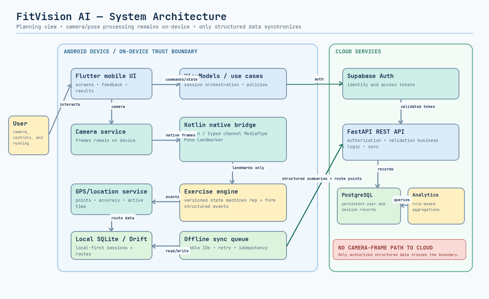
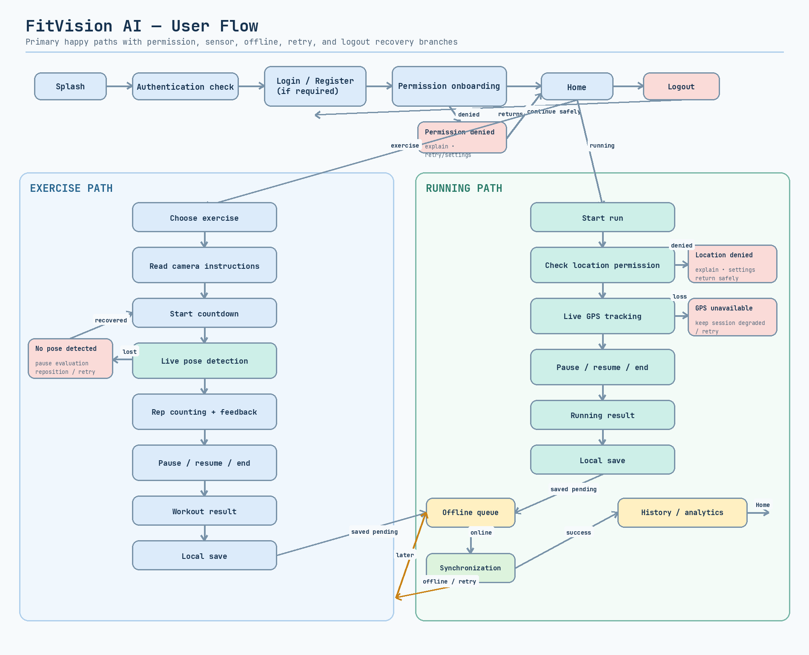
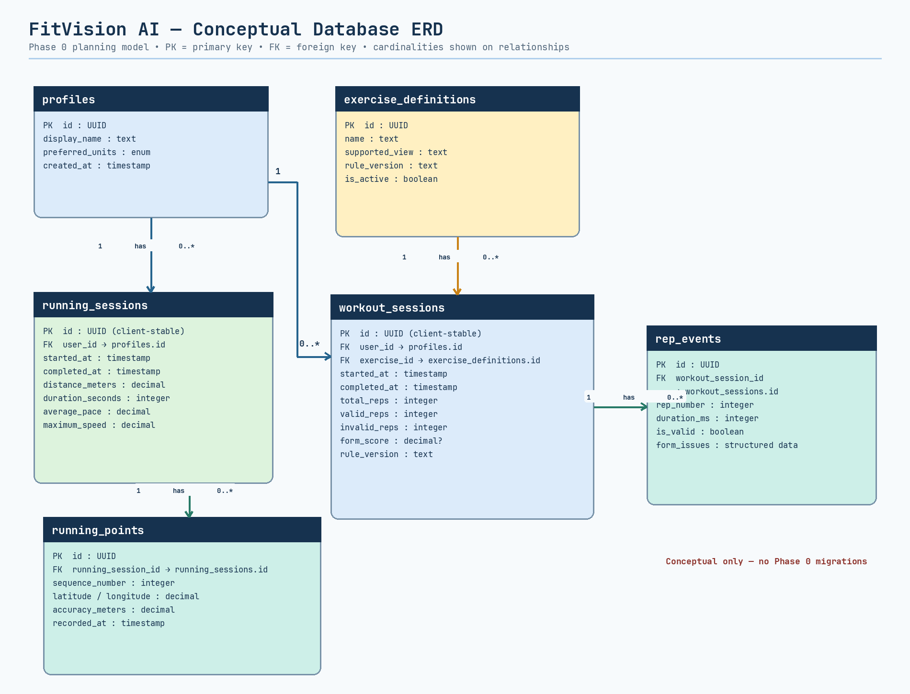

# FitVision AI

FitVision AI is an Android-first mobile-system project for future on-device exercise pose monitoring and GPS running tracking. The repository contains the complete Phase 0 requirements plus implemented Flutter and FastAPI Phase 1 foundations.

**Phase 0 completed — planning and requirements documented. Application implementation has not started.**

The statement above records the Phase 0 completion baseline. Since that milestone, separate Phase 1 backend-foundation work has been added to this repository; the current implementation status is described immediately below.

> **Current status:** Phase 4 Android CameraX/MediaPipe pose-foundation
> implementation is present. Flutter/native tests and the configured debug APK
> build pass. A vivo physical run verified front preview and live landmark
> overlay; the complete permission/lifecycle/performance/ten-minute acceptance
> run remains pending and is documented in the Phase 4 validation report.

The intended completion statement—“Phase 1 completed — Flutter and FastAPI foundations are operational”—is **not yet true**. Authentication, database, AI pose estimation, exercise tracking, GPS tracking, and final UI are not implemented.

## Problem Being Solved

Manual rep counting is distracting and unreliable, unsupervised exercise offers little immediate form feedback, wearables generally do not evaluate camera-observed form, and strength/running records are frequently fragmented. FitVision AI plans to address these gaps without uploading raw workout video by default and without presenting automated feedback as medical advice.

## Planned Features and MVP

- On-device pose landmarks, full-transition rep counting, and rule-based form feedback.
- **MVP exercises:** squats, biceps curls, and push-ups.
- **Extended scope:** lunges and planks after MVP validation.
- Running duration, route, distance, current/average speed, and current/average pace.
- Pause/resume/finish controls for workouts and runs.
- Local-first persistence, idempotent synchronization, combined history, and rule-based analytics.
- Authentication, profile/unit settings, permission recovery, user-data isolation, and deletion.

## Planned Technology Stack

| Layer | Planned technology |
|---|---|
| Mobile | Flutter and Dart, Android-first |
| Pose integration | MediaPipe Pose Landmarker via Kotlin and Pigeon or typed platform channels |
| Exercise logic | Versioned, rule-based state machines |
| Local data | SQLite with Drift |
| API | FastAPI REST service |
| Identity/cloud data | Supabase Auth and PostgreSQL through Supabase |
| Running | Android location services and a maps provider (selection pending) |
| Delivery | Docker and GitHub Actions in later phases |

## High-Level Architecture

Camera frames are processed on the device. Flutter use cases coordinate the native MediaPipe bridge, exercise engine, GPS service, local database, and offline queue. Only structured session/profile/route data is synchronized to FastAPI, which applies business and ownership rules and accesses PostgreSQL; Supabase Auth supplies identity. See the architecture diagram below for boundaries.

## Phase Roadmap

1. **Phase 0 — Planning and requirement analysis (complete):** scope, traceable requirements, acceptance baseline, risks, and diagrams. At this milestone, application implementation had not started.
2. **Phase 1 — Project foundation (validation pending):** Flutter and FastAPI foundations, environment configuration, health contract, tests, and analysis are complete; debug APK validation remains unresolved.
3. **Phase 2 — UI/UX, design system, application navigation and mock-data screens:** begins only after Phase 1 mobile acceptance checks pass.
4. **Phase 4 — camera and pose foundation:** native CameraX preview, on-device
   MediaPipe Pose Landmarker, Flutter skeleton, placement guidance, countdown
   and lifecycle-safe controls.
5. **Later phases:** exercise rules/rep counting, real GPS running, advanced
   analytics, validation and delivery.

Roadmap phases after Phase 0 are planning guidance and may change through controlled review.

## Current Repository Structure

```text
fitvision-ai/
├── docs/
│   ├── diagrams/
│   └── phases/
│       ├── phase-00-planning/
│       └── phase-01-foundation/
├── services/
│   └── api/
│       ├── app/
│       ├── tests/
│       ├── pyproject.toml
│       └── uv.lock
├── apps/
│   └── mobile/
│       ├── android/
│       ├── assets/
│       ├── lib/
│       ├── test/
│       ├── pubspec.yaml
│       └── pubspec.lock
├── .env.example
├── .gitignore
└── README.md
```

## Prerequisites

- Python 3.12 or newer and [`uv`](https://docs.astral.sh/uv/) for the backend.
- Flutter 3.44.7/Dart 3.12.2 or compatible stable versions, Android SDK, Android command-line tools, accepted licenses, and ADB.

## Backend Setup and Commands

From the repository root:

```bash
cd services/api
UV_CACHE_DIR=/tmp/fitvision-uv-cache uv sync --all-groups
UV_CACHE_DIR=/tmp/fitvision-uv-cache uv run uvicorn app.main:app --host 0.0.0.0 --port 8000 --reload
```

Run validation from `services/api/`:

```bash
UV_CACHE_DIR=/tmp/fitvision-uv-cache uv run ruff check .
UV_CACHE_DIR=/tmp/fitvision-uv-cache uv run pytest
```

The health endpoint is `http://127.0.0.1:8000/api/v1/health`; interactive API documentation is at `http://127.0.0.1:8000/docs`.

## Environment Configuration

Backend configuration is loaded from environment variables or an ignored `services/api/.env`; [.env.example](.env.example) documents safe names and empty future placeholders. Never commit real credentials.

The planned Android emulator URL is `http://10.0.2.2:8000`. For a physical device, use `adb reverse tcp:8000 tcp:8000` and then `http://127.0.0.1:8000`. Local cleartext HTTP will be allowed only in the generated Android debug manifest; production will require HTTPS.

## Mobile Setup and Commands

Ensure `/home/dhruv/development/flutter/bin` and `/home/dhruv/Android/Sdk/platform-tools` are on `PATH`, then run:

```bash
cd apps/mobile
flutter pub get
flutter analyze
flutter test
flutter run --dart-define=APP_ENV=development --dart-define=API_BASE_URL=http://10.0.2.2:8000
```

For a physical device, first run `adb reverse tcp:8000 tcp:8000`, then use `API_BASE_URL=http://127.0.0.1:8000`. Local cleartext traffic is enabled only by the Android debug manifest; production configuration requires HTTPS.

### Phase 4 camera run

The Android app requests camera permission only after the user opens an
exercise camera guide and presses **Enable camera**. It never requests
microphone, storage or location permission in Phase 4.

```bash
cd apps/mobile
adb reverse tcp:8000 tcp:8000
flutter run -d YOUR_DEVICE_ID \
  --dart-define=APP_ENV=development \
  --dart-define=API_BASE_URL=http://127.0.0.1:8000 \
  --dart-define=SUPABASE_URL=https://PROJECT.supabase.co \
  --dart-define=SUPABASE_PUBLISHABLE_KEY=PUBLIC_KEY
```

The official `pose_landmarker_lite.task` model is checked in under
`packages/pose_landmarker/android/src/main/assets/`. Its source and checksum
are recorded in
[`model-provenance.md`](docs/phases/phase-04-camera-pose-foundation/model-provenance.md).
Debug builds show landmark indices, processed FPS and inference latency; release
builds suppress debug data.

Camera frames and raw video stay on-device and are neither uploaded nor saved
by default. Phase 4 detects landmarks only: rep counting, UP/DOWN/HOLD stages,
joint angles and form scoring remain Phase 5 work.

## Phase 0 Documentation

- [Problem statement](docs/phases/phase-00-planning/problem-statement.md)
- [Scope](docs/phases/phase-00-planning/scope.md)
- [User stories](docs/phases/phase-00-planning/user-stories.md)
- [Functional requirements](docs/phases/phase-00-planning/functional-requirements.md)
- [Non-functional requirements](docs/phases/phase-00-planning/non-functional-requirements.md)
- [Supported exercises](docs/phases/phase-00-planning/supported-exercises.md)
- [Acceptance criteria and Definition of Done](docs/phases/phase-00-planning/acceptance-criteria.md)
- [Risk register](docs/phases/phase-00-planning/risks.md)
- [Editable diagram sources](docs/diagrams/source/)

## Phase 1 Documentation

- [Implementation summary](docs/phases/phase-01-foundation/implementation-summary.md)
- [Setup guide](docs/phases/phase-01-foundation/setup-guide.md)
- [Architecture decisions](docs/phases/phase-01-foundation/architecture-decisions.md)
- [Validation report](docs/phases/phase-01-foundation/validation-report.md)

## Phase 2 Documentation

- [Core mobile experience implementation guide](docs/phases/phase-02-core-mobile-experience/implementation-guide.md)

## Diagrams

### System architecture



### User flow



### Conceptual database ERD



The ERD is conceptual only; Phase 0 includes no migrations or production database schema.

## Team

This project is intended for a four-person development team. The proposal presentation was not available in the repository during Phase 0, so names and final responsibility assignments remain **to be confirmed from the proposal/project owner** rather than invented. Suggested responsibility areas are mobile/UX, pose/native integration, backend/data, and QA/DevOps, with cross-review to reduce single-person dependency.

## Current Limitations

- A real Supabase project and PostgreSQL target must be configured before
  end-to-end authentication or database migration validation.
- Workout, running, and analytics mobile screens remain mock/empty experiences;
  Phase 3 supplies storage APIs but does not implement sensing or synchronization.
- Running remains a clearly marked preview: Phase 4 adds no location
  permission, real GPS or live route.
- Pose inference is Android-only. Physical performance varies by device; consult
  the Phase 4 performance report before claiming FPS/latency targets.
- Thresholds, model performance, supported Android versions/devices, GPS filters, maps provider, and sync conflict details require Phase 1 decisions and empirical validation.
- Only one user in supported views/conditions is planned for pose monitoring.
- Automated cues may be wrong when landmarks are uncertain and are not a substitute for a qualified professional.

## Safety and Privacy

FitVision AI is an automated fitness guidance and record-keeping concept, **not a medical diagnosis, injury diagnosis, rehabilitation, or emergency system**. Users should stop exercise when they experience pain or unsafe symptoms and seek qualified advice where appropriate. Pose inference is planned on-device; raw camera frames are not uploaded by default. Structured workout data and precise running routes are sensitive and must use explicit permissions, minimized collection, HTTPS, user-scoped authorization, and reliable deletion controls.

## Next Phase

Phase 3 implements Supabase authentication, FastAPI authorization, PostgreSQL
models, Alembic migrations, RLS policies, and core user-scoped APIs. See
[`docs/phases/phase-03-auth-backend-database/`](docs/phases/phase-03-auth-backend-database/)
for setup, security, schema, API, and validation details.

The next phase is **Phase 5 — deterministic exercise analysis**. Its first task
should consume the existing `ExerciseAnalysisState` boundary and implement a
well-tested squat state machine from stable, visibility-gated landmarks before
adding curls or push-ups. Camera code must remain independent of exercise
rules.
