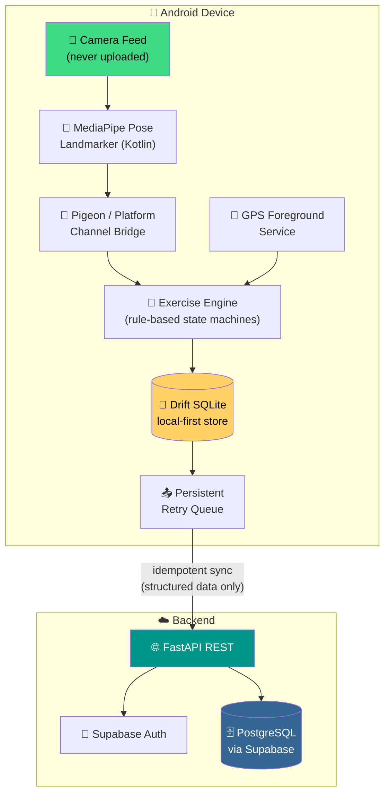
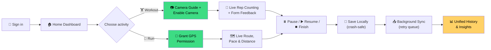
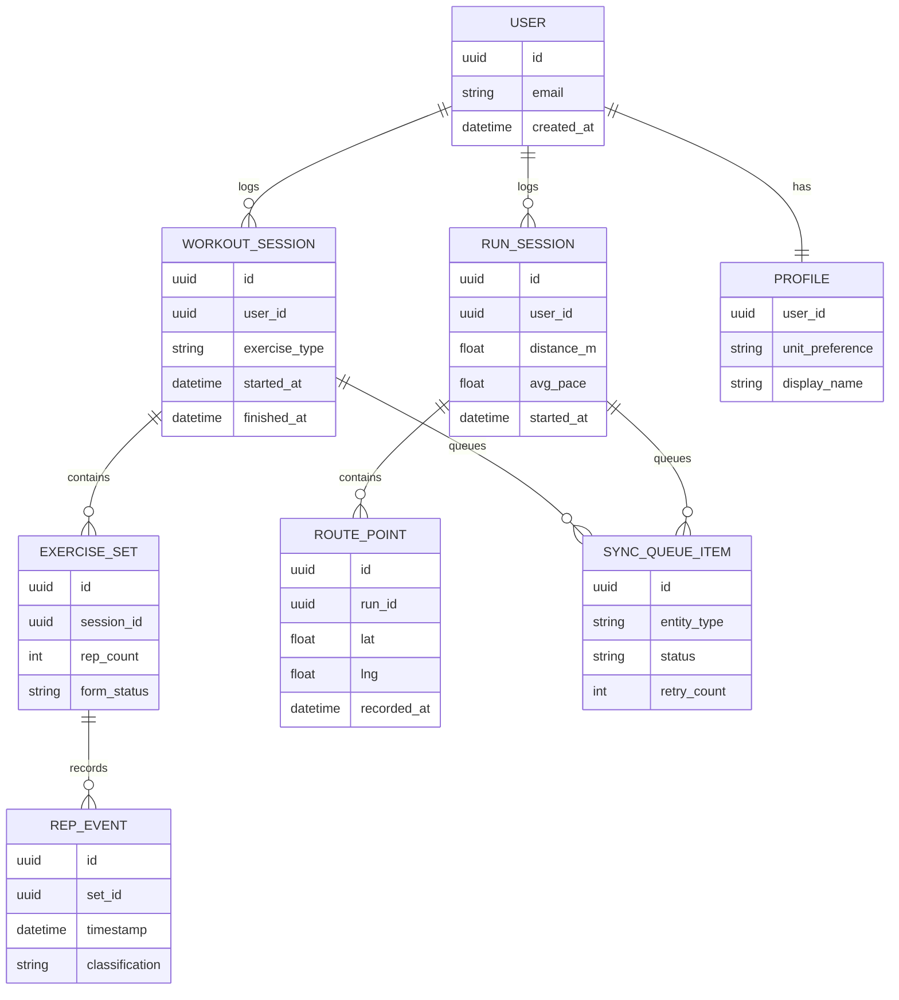
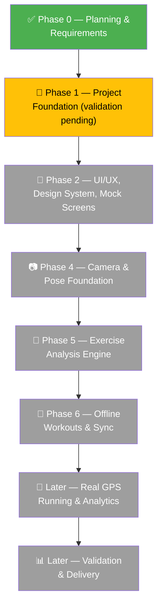

<div align="center">

# 🏋️‍♂️ FitVision AI

### On-device pose monitoring & GPS running tracking — built Android-first

**No raw video leaves your phone. No AI pretending to be a doctor. Just honest engineering.**


</div>

---

## ⚠️ Reality Check First

> 📋 **Phase 0 completed** — planning & requirements are fully documented.
> 🚧 **Phase 1 → 8 backend/mobile foundations** are implemented on top of that baseline.
> ❌ **Not yet implemented:** production auth, final AI pose estimation UX, full GPS running UI, final polished UI.

| ✅ What's real today | 🔜 What's still ahead |
|---|---|
| Drift SQLite persistence & crash-safe timers | Real Supabase auth in production |
| Local-first history + idempotent server sync | Final camera/pose UX polish |
| GPS foreground service + deterministic filtering | Live route + maps provider selection |
| Offline filters, calendar summaries, weighted pace | Lunges & planks (post-MVP) |
| Rule-coded insights (no generative AI) | End-to-end device validation |

---

## 📚 Table of Contents

- [🧠 The Problem](#-the-problem)
- [✨ Planned Features & MVP](#-planned-features--mvp)
- [🧰 Tech Stack](#-tech-stack)
- [🏗️ Architecture Diagram](#️-architecture-diagram)
- [🔄 User Flow](#-user-flow)
- [🗄️ Conceptual Data Model (ERD)](#️-conceptual-data-model-erd)
- [🗺️ Phase Roadmap](#️-phase-roadmap)
- [📁 Repository Structure](#-repository-structure)
- [🚀 Quick Start Guide](#-quick-start-guide)
- [🧪 Testing & Validation](#-testing--validation)
- [🔐 Environment Configuration](#-environment-configuration)
- [📱 Phase 4: Running the Camera Build](#-phase-4-running-the-camera-build)
- [🧩 Phase 5 & 6 Checks](#-phase-5--6-checks)
- [📖 Documentation Index](#-documentation-index)
- [👥 Team](#-team)
- [🚧 Current Limitations](#-current-limitations)
- [🛡️ Safety & Privacy](#️-safety--privacy)
- [➡️ Next Phase](#️-next-phase)

---

## 🧠 The Problem

😤 **Manual rep counting** is distracting and unreliable.
🙈 **Unsupervised exercise** gives zero real-time form feedback.
⌚ **Wearables** track heart rate — not whether your squat form is safe.
📉 **Strength & running records** end up scattered across apps and notebooks.

**FitVision AI's answer:** on-device pose analysis and rule-based coaching — no raw video uploads by default, and never marketed as medical advice.

---

## ✨ Planned Features & MVP

<table>
<tr>
<td width="50%" valign="top">

### 🏃 MVP Exercises
- 🏋️ Squats
- 💪 Biceps curls
- 🙆 Push-ups

**Extended (post-MVP):**
- 🦵 Lunges
- 🧘 Planks

</td>
<td width="50%" valign="top">

### 🎯 Core Capabilities
- 🎥 On-device pose landmarks
- 🔢 Full-transition rep counting
- 📐 Rule-based form feedback
- ⏸️ Pause / resume / finish controls
- 📍 Route, distance, speed & pace tracking
- ☁️ Local-first sync, combined history
- 🔐 Auth, profile/unit settings, data deletion

</td>
</tr>
</table>

---

## 🧰 Tech Stack

| Layer | 🔧 Planned Technology |
|---|---|
| 📱 Mobile | Flutter & Dart, Android-first |
| 🕺 Pose integration | MediaPipe Pose Landmarker via Kotlin + Pigeon / typed platform channels |
| 🧮 Exercise logic | Versioned, rule-based state machines |
| 💾 Local data | SQLite via Drift |
| 🌐 API | FastAPI REST service |
| 🔑 Identity / cloud data | Supabase Auth + PostgreSQL |
| 🗺️ Running | Android location services + maps provider (TBD) |
| 🚢 Delivery | Docker + GitHub Actions (later phases) |

---

## 🏗️ Architecture Diagram

Camera frames stay **on-device**. Flutter coordinates the native MediaPipe bridge, exercise engine, GPS service, local DB, and offline sync queue. Only structured session/profile/route data reaches the backend.



---

## 🔄 User Flow



---

## 🗄️ Conceptual Data Model (ERD)

> 📝 Conceptual only — Phase 0 includes no migrations or production schema.



---

## 🗺️ Phase Roadmap



> ℹ️ Roadmap phases after Phase 0 are planning guidance and **may change through controlled review**.

<details>
<summary>📖 <b>Click for full phase descriptions</b></summary>

- **Phase 0 — Planning** *(complete)*: scope, traceable requirements, acceptance baseline, risks, and diagrams.
- **Phase 1 — Foundation** *(validation pending)*: Flutter & FastAPI foundations, environment config, health contract, tests, analysis complete; debug APK validation unresolved.
- **Phase 2 — UI/UX**: design system, navigation, mock-data screens — begins after Phase 1 mobile acceptance checks pass.
- **Phase 4 — Camera & Pose**: native CameraX preview, on-device MediaPipe Pose Landmarker, Flutter skeleton, placement guidance, countdown, lifecycle-safe controls.
- **Phase 5 — Exercise Analysis**: pure-Dart geometry, smoothing, confidence filtering, full-cycle rep state machines, form feedback, live results.
- **Phase 6 — Offline & Sync**: local session/rep storage, recovery, reactive history, idempotent synchronization.
- **Later phases**: real GPS running, advanced analytics, validation and delivery.

</details>

---

## 📁 Repository Structure

```
fitvision-ai/
├── docs/
│   ├── diagrams/
│   └── phases/
│       ├── phase-00-planning/
│       └── phase-01-foundation/
├── services/
│   └── api/
│       ├── app/
│       ├── tests/
│       ├── pyproject.toml
│       └── uv.lock
├── apps/
│   └── mobile/
│       ├── android/
│       ├── assets/
│       ├── lib/
│       ├── test/
│       ├── pubspec.yaml
│       └── pubspec.lock
├── .env.example
├── .gitignore
└── README.md
```

---

## 🚀 Quick Start Guide

### ✅ Prerequisites

- 🐍 **Python 3.12+** and **[uv](https://github.com/astral-sh/uv)** for the backend
- 🐦 **Flutter 3.44.7 / Dart 3.12.2** (or compatible stable versions)
- 🤖 Android SDK, Android command-line tools (licenses accepted), and ADB

---

### 1️⃣ Backend Setup

```bash
cd services/api
UV_CACHE_DIR=/tmp/fitvision-uv-cache uv sync --all-groups
UV_CACHE_DIR=/tmp/fitvision-uv-cache uv run uvicorn app.main:app --host 0.0.0.0 --port 8000 --reload
```

🩺 Health check → `http://127.0.0.1:8000/api/v1/health`
📖 Interactive API docs → `http://127.0.0.1:8000/docs`

**Validate the backend** (run from `services/api/`):

```bash
UV_CACHE_DIR=/tmp/fitvision-uv-cache uv run ruff check .
UV_CACHE_DIR=/tmp/fitvision-uv-cache uv run pytest
```

---

### 2️⃣ Environment Configuration

🔒 Configuration loads from environment variables or an **ignored** `services/api/.env`.
📄 `.env.example` documents safe variable names and empty placeholders.

> ⚠️ **Never commit real credentials.**

| Scenario | Base URL |
|---|---|
| 🖥️ Android Emulator | `http://10.0.2.2:8000` |
| 📱 Physical Device | `adb reverse tcp:8000 tcp:8000` → then `http://127.0.0.1:8000` |
| 🏭 Production | HTTPS required |

Cleartext HTTP is allowed **only** in the generated Android debug manifest.

---

### 3️⃣ Mobile Setup

Make sure these are on your `PATH`:

```bash
/home/dhruv/development/flutter/bin
/home/dhruv/Android/Sdk/platform-tools
```

Then run:

```bash
cd apps/mobile
flutter pub get
flutter analyze
flutter test
flutter run --dart-define=APP_ENV=development --dart-define=API_BASE_URL=http://10.0.2.2:8000
```

📱 **Physical device?**

```bash
adb reverse tcp:8000 tcp:8000
# then use API_BASE_URL=http://127.0.0.1:8000
```

---

## 📱 Phase 4: Running the Camera Build

🎥 The app requests **camera permission only** after the user opens an exercise camera guide and taps **Enable camera**.
🚫 It **never** requests microphone, storage, or location permission in Phase 4.

```bash
cd apps/mobile
adb reverse tcp:8000 tcp:8000
flutter run -d YOUR_DEVICE_ID \
  --dart-define=APP_ENV=development \
  --dart-define=API_BASE_URL=http://127.0.0.1:8000 \
  --dart-define=SUPABASE_URL=https://PROJECT.supabase.co \
  --dart-define=SUPABASE_PUBLISHABLE_KEY=PUBLIC_KEY
```

📦 The official `pose_landmarker_lite.task` model ships under:
`packages/pose_landmarker/android/src/main/assets/`
🔎 Source & checksum recorded in `model-provenance.md`.

| Build type | Debug overlay |
|---|---|
| 🐛 Debug | Landmark indices, processed FPS, inference latency |
| 🚀 Release | Debug data suppressed |

🔐 Camera frames and raw video stay **on-device** — never uploaded or saved by default.
📐 Phase 5 converts normalized landmarks into deterministic movement events; it does **not** persist raw pose coordinates.

---

## 🧩 Phase 5 & 6 Checks

### 🧮 Phase 5 — Exercise Engine

```bash
dart format packages/exercise_engine
dart analyze packages/exercise_engine
dart test packages/exercise_engine

cd apps/mobile
flutter pub get
flutter analyze
flutter test
```

📖 See Phase 5 documentation for details.

### 💾 Phase 6 — Database & Sync

```bash
cd apps/mobile
dart run build_runner build --delete-conflicting-outputs
flutter analyze
flutter test
```

Apply backend migrations **before** server sync:

```bash
cd services/api
UV_CACHE_DIR=/tmp/fitvision-uv-cache uv run alembic upgrade head
```

📖 See Phase 6 documentation for details.

---

## 🧪 Testing & Validation

| Component | Command |
|---|---|
| 🐍 Backend lint | `uv run ruff check .` |
| 🐍 Backend tests | `uv run pytest` |
| 🐦 Mobile analysis | `flutter analyze` |
| 🐦 Mobile tests | `flutter test` |
| 🧮 Exercise engine | `dart analyze` / `dart test` |
| 💾 DB codegen | `dart run build_runner build --delete-conflicting-outputs` |

---

## 📖 Documentation Index

<table>
<tr><td>

**📋 Phase 0**
- Problem statement
- Scope
- User stories
- Functional requirements
- Non-functional requirements
- Supported exercises
- Acceptance criteria & DoD
- Risk register
- Editable diagram sources

</td><td>

**🔧 Phase 1**
- Implementation summary
- Setup guide
- Architecture decisions
- Validation report

**🎨 Phase 2**
- Core mobile experience guide

</td></tr>
</table>

---

## 👥 Team

👤👤👤👤 This project is intended for a **four-person development team**.

> ℹ️ The proposal presentation was not available in the repository during Phase 0. Names and final responsibility assignments are **to be confirmed** from the proposal/project owner — not invented.

**Suggested responsibility areas** (cross-review encouraged to reduce single-person dependency):

| Area | Icon |
|---|---|
| Mobile / UX | 📱 |
| Pose / Native Integration | 🕺 |
| Backend / Data | 🗄️ |
| QA / DevOps | 🧪 |

---

## 🚧 Current Limitations

- ☁️ A real **Supabase project & PostgreSQL target** must be configured before end-to-end auth or DB migration validation.
- 🖼️ Workout, running, and analytics screens remain **mock/empty**; Phase 3 supplies storage APIs but not sensing/sync.
- 🏃 Running is a **clearly marked preview** — Phase 4 adds no location permission, real GPS, or live route.
- 🤖 Pose inference is **Android-only**; performance varies by device — consult the Phase 4 performance report before claiming FPS/latency targets.
- 📊 Thresholds, model performance, supported Android versions/devices, GPS filters, maps provider, and sync-conflict details require **Phase 1 decisions and empirical validation**.
- 👤 Only **one user** in supported views/conditions is planned for pose monitoring.
- ⚠️ Automated cues may be wrong when landmarks are uncertain and are **not a substitute for a qualified professional**.

---

## 🛡️ Safety & Privacy

> 🩺 **FitVision AI is an automated fitness guidance and record-keeping concept — not a medical diagnosis, injury diagnosis, rehabilitation, or emergency system.**

- 🛑 Stop exercising if you experience pain or unsafe symptoms; seek qualified advice where appropriate.
- 🎥 Pose inference is planned **on-device**; raw camera frames are **not uploaded by default**.
- 🔐 Structured workout data and precise running routes are sensitive and require:
  - ✅ Explicit permissions
  - ✅ Minimized data collection
  - ✅ HTTPS
  - ✅ User-scoped authorization
  - ✅ Reliable deletion controls

---

## ➡️ Next Phase

**Phase 3** implements:

🔑 Supabase authentication • 🛡️ FastAPI authorization • 🗄️ PostgreSQL models • 🧬 Alembic migrations • 🔒 RLS policies • 🌐 Core user-scoped APIs

📁 See `docs/phases/phase-03-auth-backend-database/` for setup, security, schema, API, and validation details.

🎯 **Next delivery focus:** physical-device calibration of Phase 5 thresholds and the later GPS/persistence work. Camera code remains independent of exercise rules.

---

<div align="center">

### 🏃‍♀️ Built with intention. Documented with honesty. 🏋️‍♂️


</div>